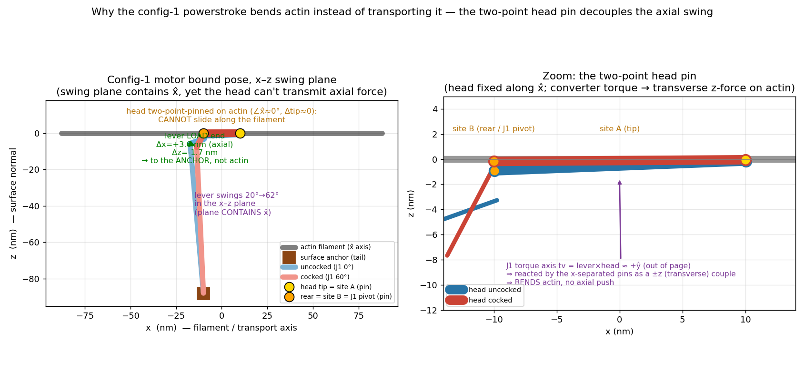

# Phase-2 BOUND GEOMETRY — the config-1 motor's actual bound pose through the powerstroke, vs canonical myosin-II

**2026-06-29. MEASUREMENT-ONLY (`-boundgeom`); single motor, gliding topology, dt=1e-6, Brownian OFF; NO physics
edit, no fix, no default change. `BoA-v1ref` byte-clean. CPU host-side, single motor, sub-second.**



## TL;DR — it is the TWO-POINT HEAD PIN, not the swing-plane orientation
A surprise that **refines the force-decomposition story**: the converter **swing plane CONTAINS the filament axis**
(it sweeps in the x–z plane, normal = ŷ), and the **lever's load end DOES sweep along the filament** (Δx +3.6 nm >
Δz −1.7 nm) — both *canonical-like*. But the filament still gets only a **transverse** force, because the **head is
rigidly two-point-pinned on actin** (head ∠x̂ ≈ 0–2°, head-tip displacement ≈ 0): it **cannot slide along actin**, so
the axial part of the swing is delivered to the **ANCHOR side** (the lever/rod reconfigure toward the fixed tail),
and the head transmits to actin only the **transverse reaction** of the converter torque (tv = lever×head ≈ +ŷ,
reacted by the two x-separated pins as a ±z couple ⇒ bending). So the misprojection is **not** "the swing plane is
perpendicular to transport" (it isn't) — it is **the two-point pin decoupling the head from axial sliding**.

## (1) Body geometry at the two equilibria (filament frame: x̂=actin axis, ẑ=surface normal, ŷ=x̂×ẑ; nm)
| state | body | end1 (nm) | end2 (nm) | uVec |
|---|---|---|---|---|
| **uncocked** (J1 0°) | rod | (−10.0, 0, −87.6) | (−17.1, 0, −7.9) | (−0.088, 0, +0.996) |
| | lever | (−17.3, 0, −6.0) | (−9.7, 0, −3.3) | (+0.942, 0, +0.336) |
| | head | (−9.9, 0, −0.9) | (+10.0, 0, −0.2) | (+0.999, 0, +0.039) |
| **cocked** (J1 60°) | rod | (−10.0, 0, −87.9) | (−13.7, 0, −8.0) | (−0.046, 0, +0.999) |
| | lever | (−13.7, 0, −7.7) | (−10.0, 0, −0.6) | (+0.465, 0, +0.885) |
| | head | (−10.0, 0, −0.2) | (+10.0, 0, −0.1) | (+1.000, 0, +0.006) |

Key points (cocked): surface **anchor** = (−10.0, 0, −88.0); **J1 pivot = rear pin (site B)** = head.end1 = (−10.0,
0, −0.2); **head tip (site A)** = head.end2 = (+10.0, 0, −0.05); **lever LOAD end** = lever.end1 = (−13.7, 0, −7.7).
Everything lies in the **y = 0 plane** (Brownian off ⇒ purely planar) — the swing is entirely in x–z.

## (2) The converter swing axis + plane
- **tv = lever.uVec × head.uVec** = (0, +0.30, 0) uncocked → (0, +0.88, 0) cocked ⇒ **≈ +ŷ** (the J1 torque axis lies
  on y, out of the filament direction).
- **Lever rotation axis (uncocked→cocked)** = (0, −1, 0) = **−ŷ** ⇒ the **swing plane normal is ŷ**, so the **swing
  plane is x–z, which CONTAINS the filament x̂ axis** (the canonical "lever swings in a plane containing the actin
  axis" condition is *met* geometrically).

## (3) The lever LOAD end (lever.end1) displacement uncocked→cocked — the working sweep
- **Δ(lever.end1) = Δx +3.58 nm (axial), Δz −1.72 nm (transverse), Δy 0** ⇒ the load end sweeps **ALONG the filament**
  (Δx > Δz, ~2:1 axial), a ~3.6 nm axial working stroke. **BUT** lever.end1 is the **rod/J2 side** — this axial sweep
  is transmitted to the **ANCHOR** (the rod rotates about the fixed tail; rod.uVec x-component −0.088→−0.046), **NOT
  to the filament.**
- **Δ(head tip, the filament side) = Δx −0.035 nm, Δz +0.103 nm, Δy 0** ⇒ the head-on-actin point is **essentially
  immobile** (two-point-pinned). The converter's axial stroke never reaches actin as translation.

## (4) How the motor stands on the filament
| | head ∠x̂ | lever ∠x̂ | rod ∠x̂ |
|---|---|---|---|
| uncocked | 2.2° | 19.6° | 84.9° |
| cocked | 0.4° | 62.3° | 87.4° |
⇒ the **head lies along actin** (∠x̂≈0°, fixed by the two-point pin), the **lever swings 20°→62°** (43°, in x–z), the
**rod stands ≈⊥ to actin** (≈86°, hanging to the anchor). The motor "stands" with its rod perpendicular and head flat
on the filament.

## Comparison to canonical myosin-II (stated, not fixed)
- **Canonical:** the lever swings in a plane containing the actin axis, and the swing moves the **head's attachment
  on actin along the filament** (the head pivots/translates on actin, single effective attachment region) ⇒ the
  working stroke is delivered to **actin** as axial sliding.
- **This model:** the swing plane **also** contains the actin axis ✓ and the lever load end **also** sweeps axially ✓
  — but the head is pinned at **TWO** points (tip + rear), fixing its position AND orientation on actin, so the head
  **cannot translate on actin**. The axial stroke is therefore delivered to the **load/anchor side** (lever.end1 →
  rod → tail), and the only thing reaching actin is the **transverse reaction** of the converter torque (the y-axis
  tv reacted by the x-separated pins ⇒ a z bending couple). **Same swing geometry, opposite delivery** — because of
  the head↔actin coupling, not the swing plane.

## WHY the powerstroke bends instead of transports — plain statement (the artifact to understand)
**The two-point head pin.** It rigidly fixes the head along actin (position + orientation). In canonical myosin the
converter swing slides the head's contact ALONG actin (axial transport); here the head can't slide, so:
1. the **axial** component of the swing is absorbed by the lever/rod reconfiguring toward the fixed **anchor** (the
   load end moves +3.6 nm in x, the rod rotates about the tail) — it never reaches actin;
2. the head transmits to actin only the **transverse reaction** of the converter torque — tv = lever×head ≈ +ŷ
   (because the head lies along x̂ while the lever swings in x–z), and the two pins separated along x̂ convert that
   y-torque into a ±z (transverse) force couple ⇒ **bending** (the SET-A whipping), not transport.

So, answering the task's three candidates: it is **primarily the two-point head pin** (head can't slide on actin),
with the **head-vs-lever bound orientation** (head along x̂, lever swinging in x–z) setting the converter torque axis
to ŷ so the x-separated pins react it transversely. It is **NOT** the anchor direction per se, and **NOT** a
swing-plane-perpendicular issue (the swing plane contains x̂). **This refines `PHASE2_FORCE_DECOMPOSITION_FINDINGS`**
(which loosely said "swing plane perpendicular to transport"): the force is transverse, but the geometric root is the
two-point pin's decoupling of the head from axial sliding, not the swing-plane orientation.

## Implication for the planner (report only)
To make the converter stroke transport, the head must be able to convert the (axial-containing) swing into **axial
force on actin** — i.e. the head's contact must slide/pivot ALONG actin (the canonical single-region attachment, or
the default motor's F9 head-pivot-on-actin 90°→120° that the canonical re-architecture dropped). As long as the head
is rigidly **two-point-pinned**, the converter torque can only present a transverse couple to actin. The decision
(relax the two-point pin to a single sliding attachment / add a head-pivot-on-actin transport term / re-orient the
converter axis) is the planner's — NOT made here.

## What changed (additive; measurement-only; default & `BoA-v1ref` untouched)
- `GlidingHarness.java`: `-boundgeom` (`boundGeom` + `geomSnap` + small vector helpers; reuses the `-forcedecomp`
  single-motor transport setup + `motorStep`; NO kernel edited). Writes `bound_geometry.csv`.
- `bound_geometry_schematic.png` (the schematic; matplotlib from the CSV).
```
./run_gliding.sh -boundgeom     # uncocked/cocked body geometry, swing plane, lever-end Δ, angles; writes bound_geometry.csv
python3 scratch_boundgeom_plot.py   # the schematic
```

## CPU-fallback disclosure
Single motor, deterministic, host-side (no TaskGraph) — runs in < 2 s on the CPU. No GPU, no long run.
