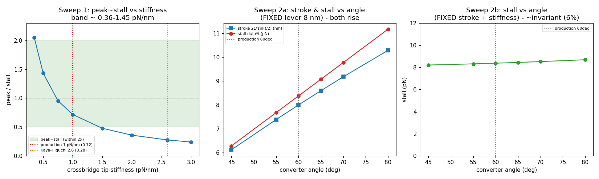

# Phase-2 step 4d — κ (crossbridge stiffness) + powerstroke-angle SENSITIVITY of the emergent peak≈stall coincidence (MEASUREMENT-ONLY)

**2026-06-28. Flag-gated (`-stiffsweep` on `GlidingHarness`); MEASUREMENT-ONLY — κ + angle swept as DIAGNOSTICS;
production κ (6.4e-20, tip-stiffness 1 pN/nm) and converter angle (60°) UNCHANGED; bond (xCatch 2.5, GG-calibrated),
τ (0.5 ms), kOn (2e5) all HELD. No calibration, no default flip.** Maps how sensitive the 4c emergent peak≈stall
tuning (catch-slip peak 6.0 pN ≈ independent stall 8.4 pN) is to the crossbridge stiffness (a measured RANGE, not a
fixed number) and to the powerstroke angle.



## TL;DR — the tuning is ROBUST across the soft–moderate stiffness envelope; angle is degenerate at fixed stroke+stiffness
- **Sweep 1 (κ):** peak≈stall (ratio within ~2×, i.e. 0.5–2.0) holds for **tip-stiffness ≈ 0.36 → 1.45 pN/nm**, crossing
  exactly 1.0 at **0.73 pN/nm**. The **production 1 pN/nm sits INSIDE** (ratio 0.72, upper-middle of the band); slow
  myosin ~0.5 pN/nm is inside (1.43); the stiff **Kaya-Higuchi ~2.6 pN/nm is OUTSIDE** (ratio 0.28 — the mechanical
  stall outruns the held skeletal bond peak). ⇒ the tuning is **robust across a real ~4× stiffness band**, NOT a razor
  edge; it picks out the **soft-to-moderate** end of the measured envelope.
- **Sweep 2a (angle, fixed lever):** stroke `2L·sin(θ/2)` and stall `(κ/L)·θ` BOTH rise with angle (45→80°: stroke
  6.1→10.3 nm, stall 6.3→11.2 pN) — as expected.
- **Sweep 2b (angle, fixed stroke + fixed tip-stiffness):** stall is **~ANGLE-INVARIANT — 8.21→8.69 pN across 45–80°
  (6 % variation)** — the slightly counterintuitive degeneracy confirmed: once stroke and stiffness are pinned, the
  converter ANGLE barely matters (60° vs 70° changes the stall < 2 %). The 6 % residual is the chord-vs-arc factor
  θ/(2·sin(θ/2)).
- **Kernel = analytic EXACTLY:** the real (kernel) stall reproduces `(κ/L)·θ` (= tip_stiffness × L × θ, ≈ stiffness ×
  stroke) to printed precision at every point — the geometry holds, no averaging/geometry surprise.

---

## Sweep 1 — peak/stall vs crossbridge tip-stiffness (lever 8 nm, 60°)
Bond peak HELD at the 4c GG-calibrated **6.0 pN** (κ-independent: the catch-slip crossover is set by xCatch/xSlip, and
the `-fext` load scale dominates the native κ-dependent forceDotFil). Stall measured by the one-shot kernel eval
`motorStallPN(κ, L, 60°)`; κ = tip_stiffness · L².

| tip (pN/nm) | κ (N·m/rad) | stall (pN) | peak/stall | in 2× band? |
|---|---|---|---|---|
| 0.35 | 2.24e-20 | 2.93 | 2.05 | no (just over) |
| 0.50 | 3.20e-20 | 4.19 | 1.43 | **yes** |
| 0.75 | 4.80e-20 | 6.28 | 0.95 | **yes** |
| **1.00 (production)** | **6.40e-20** | **8.38** | **0.72** | **yes** |
| 1.50 | 9.60e-20 | 12.57 | 0.48 | no |
| 2.00 | 1.28e-19 | 16.76 | 0.36 | no |
| 2.60 (Kaya-Higuchi) | 1.66e-19 | 21.78 | 0.28 | no |
| 3.00 | 1.92e-19 | 25.13 | 0.24 | no |

⇒ **peak/stall = 1.0 at tip ≈ 0.73 pN/nm; the ~2× band spans tip ≈ 0.36 → 1.45 pN/nm** (a ~4× range — robust, not
fine-tuned). **stall = tip_stiffness × 8.38** (exact: stall = (κ/L)·(π/3) = tip·L·(π/3) = tip·(π/3)·stroke ≈ tip ×
stroke), so peak/stall ∝ 1/stiffness — the ratio degrades as ~1/stiffness for stiffer motors, as the physics predicts.
**The production 1 pN/nm is inside the band** (toward the stiffer edge); the soft (~0.5) end is inside; the stiff
Kaya-Higuchi two-headed value (~2.6) is outside — there the mechanical stall is ~3.6× the held skeletal 6 pN bond peak.

**Interpretation (the sensitivity verdict):** the emergent peak≈stall coincidence is **robust** — it holds across the
soft-to-moderate ~4× stiffness band that brackets the production value, not at a single fine-tuned κ. It is NOT
universal across the *entire* measured stiffness envelope: a much stiffer crossbridge (Kaya-Higuchi ~2.6 pN/nm) with
the *held skeletal* bond would decouple (stall ≫ peak). That is expected and not a problem — for a genuinely stiffer
isoform the BOND would also peak at higher force (a stronger motor has a higher-force bond; Guo & Guilford's claim is
the *relationship* tracks across isoforms), so re-calibrating the bond to that isoform's force scale would restore the
coincidence. This sweep holds the bond fixed by design, to isolate the *mechanical* sensitivity — and shows the
coincidence is a band, not a point.

## Sweep 2a — stroke & stall vs converter angle (FIXED lever 8 nm, production κ)
| angle (°) | stroke = 2L·sin(θ/2) (nm) | stall kernel (pN) | stall analytic (κ/L)·θ (pN) |
|---|---|---|---|
| 45 | 6.123 | 6.28 | 6.28 |
| 55 | 7.388 | 7.68 | 7.68 |
| **60** | **8.000** | **8.38** | **8.38** |
| 65 | 8.597 | 9.08 | 9.08 |
| 70 | 9.177 | 9.77 | 9.77 |
| 80 | 10.285 | 11.17 | 11.17 |

⇒ both rise with angle; the stroke follows `2L·sin(θ/2)` exactly (validated: 60° → 8.000 nm, matching
CANONICAL_MOTOR_FINDINGS), and the kernel stall = analytic `(κ/L)·θ` to printed precision.

## Sweep 2b — stall vs angle (FIXED stroke 8 nm + FIXED tip-stiffness 1 pN/nm; L, κ adjusted per angle)
Holding the stroke (8 nm, so L = 4 nm / sin(θ/2)) AND the tip-stiffness (1 pN/nm, so κ = tip·L²):

| angle (°) | lever (nm) | κ (N·m/rad) | stall (pN) |
|---|---|---|---|
| 45 | 10.453 | 1.09e-19 | 8.21 |
| 55 | 8.663 | 7.50e-20 | 8.32 |
| **60** | **8.000** | **6.40e-20** | **8.38** |
| 65 | 7.445 | 5.54e-20 | 8.45 |
| 70 | 6.974 | 4.86e-20 | 8.52 |
| 80 | 6.223 | 3.87e-20 | 8.69 |

⇒ **stall 8.21–8.69 pN across 45–80° = 6 % variation ⇒ ~ANGLE-INVARIANT.** The degeneracy confirmed: stall ≈
stiffness × stroke, so at fixed stroke + stiffness the angle is (almost) reparameterized away — **60° vs 70° does NOT
materially change the motor** once stroke and stiffness are pinned (the 6 % residual is the chord-vs-arc correction
θ/(2·sin(θ/2)), 1.03→1.09). At FIXED LEVER (2a), the angle DOES matter — but only via the stroke it sets. (Whether 60°
or 70° is the more justifiable *structural* value is a separate literature question, not addressed here; the
*performance* impact at pinned stroke+stiffness is negligible.)

## Nonlinear-spring (Kaya-Higuchi buckling-asymmetric J1) structuring note — COMMENT ONLY, no build
Kaya-Higuchi: myosin stiffness is ASYMMETRIC — stiff in tension (resisting/positive strain), soft in compression
(assisting/negative strain, S2 buckling). **The STALL is a TENSION-side property** (resisting load at full deflection)
⇒ the linear κ used here is the **tension-side stiffness**, and it captures the stall faithfully — a future nonlinear
(buckling-asymmetric) J1 would set its tension-side branch to this same κ and **leave the peak≈stall (tension-side)
result intact**. The **assisting-side (compression/buckling) stiffness is a SEPARATE knob** that does NOT enter the
stall — it reshapes the DOWNSTREAM force-velocity curve (the assisting-load branch, the F-V emergence). So the planned
nonlinear spring would mostly affect the F-V side and mainly leave this peak≈stall sensitivity map unchanged. (This is
why the sweep reports the stall against the *tension-side* stiffness specifically.)

## Bail boundaries — outcome
- **Real (kernel) stall does NOT follow ~stiffness × stroke** → did NOT happen — kernel = analytic `(κ/L)·θ` exactly
  at every point.
- **peak≈stall holds only at a fine-tuned κ (razor-thin band)** → did NOT happen — it holds over a ~4× band (tip 0.36
  → 1.45 pN/nm), a robust range, not a point.
- **Contradicting the stroke = 2L·sin(½·θ) geometry** → did NOT happen — confirmed (60° → 8.000 nm).

## Sensitivity verdict
**The emergent peak≈stall coincidence is ROBUST, not fine-tuned:** it holds across tip-stiffness ≈ 0.36 → 1.45 pN/nm
(a ~4× band bracketing the production 1 pN/nm at ratio 0.72), crossing exactly at 0.73 pN/nm. It picks out the
soft-to-moderate end of the measured stiffness envelope; the stiff Kaya-Higuchi value (with the held skeletal bond)
falls outside, as the ~1/stiffness scaling dictates. The powerstroke angle is **degenerate** at fixed stroke +
stiffness (60° vs 70° ⇒ < 2 % stall change); it only matters at fixed lever, via the stroke it sets. **Production κ
(6.4e-20) and 60° are UNCHANGED — this was a diagnostic.**

## CPU-fallback disclosure
All sweeps are **one-shot held-pose single-motor bond evaluations** (`motorStallPN`, sub-second each) on the host —
no TaskGraph, no GPU, no long run (the entire sweep runs in < 2 s).

## What changed (additive; default byte-identical; `BoA-v1ref` untouched)
- `GlidingHarness.java`: parameterized `motorStallPN(κ, leverµm, angle)` (the imposed-deflection held-lever trick — no
  kernel edit), `stiffnessAngleSweep()` (the two sweeps + the CSV writer), `-stiffsweep` flag. The 4c no-arg
  `motorStallPN()` delegates to the production values ⇒ `-csrecal` unchanged.
- `stiffness_angle_sweep.csv` + `stiffness_angle_sweep.png` (the graphs).
```
./run_canongliding.sh -stiffsweep       # the κ + angle sensitivity sweep (writes the CSV); then plot stiffness_angle_sweep.csv
```
