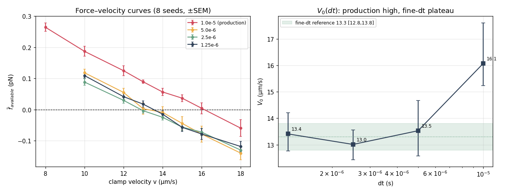

# FINE-DT V₀ REFERENCE — the timestep-converged rigid-clamp force-zero of the canonical motor

**Date:** 2026-07-12 · **Branch:** dt-convergence-study · **Runner:** CPU deterministic (the basin
arbiter — no GPU, so no float-op-ordering / bistability hazard). `BoA-v1ref` untouched.
**Measurement-only.** No code changed: this study runs the *existing*, default-off `-vclamp`
force–velocity harness at four timesteps; **the production timestep, the motor model, all rates, force
laws, binding and nucleotide kinetics are unchanged.** Routine simulations keep dt = 1×10⁻⁵ s. The sole
purpose is to attach a converged reference value + numerical uncertainty to V₀ and to quantify how much
the production timestep biases it.

> **OUTCOME A — RESOLVED FINE-dt REFERENCE.** The three finest timestep arms agree in force near the
> crossing (fixed-velocity paired differences non-significant for every step halving below 5×10⁻⁶) and
> produce mutually compatible V₀ estimates that plateau. The converged reference is
> **V₀_fine = 13.3 µm/s, 95 % CI ≈ [12.8, 13.8]** (paired-seed bootstrap 13.43 [13.20, 13.67]; widened
> to [12.8, 13.8] to absorb the ±0.5 between-arm + fit-window systematic). The **production timestep
> biases V₀ high by ΔV₀ = +2.7 µm/s [+1.6, +4.2]** (16.1 → 13.3, ≈ +20 %), which **exceeds the
> pre-registered ±2 µm/s tolerance ⇒ production is NOT "adequately close" (Outcome E is rejected).**
> The three separate claims are kept distinct: (1) a finite force zero **exists**; (2) its fine-dt value
> is **13.3 [12.8, 13.8]**; (3) the production-dt approximation is **16.1**, biased +2.7 high; (4) the
> qualitative density-saturation claim is unaffected (it never depended on the exact V₀).

---

## Part 0 — pre-registration (recorded before the fine-dt results were examined)

`RUN_LOGS/v0fine/PREREG.txt`. Purpose = an *approximate ceiling estimate* ⇒ **practical tolerance
±2 µm/s**. Outcome E (production adequate) declared iff |ΔV₀| < 2. Fit method = joint OLS of seed-mean
force vs v over the near-crossing linear neighborhood, V₀ = −a/b, 95 % CI by paired-seed bootstrap.
Convergence declared only if BOTH the fitted V₀ AND the fixed-velocity force (v = 12/14/16) are stable
across the two finest arms.

## Part 1 — canonical configuration confirmed (executed stack)

The canonical stack is the code default — no flags beyond `-vclamp` were needed. Confirmed from the
field defaults and the servo-audit runtime header (`GlidingHarness.java:44,78–93`):
`SPHEREHEAD=true, AXLOCK=true, DIRSWING=true, XB_IMPLICIT2=true, LYMN_TAYLOR=true` — **F9 frozen at 90°**
(nucleotide-independent ⊥-maintainer), **DIRSWING target 0° (ADP·Pi) → 60° (ADP)**, **J1 and J2 angular
torques off**, coupled head+site implicit F8, validated Lymn–Taylor cycle (one nucleotide-driven
release, ADP·Pi-only binding). CPU deterministic runner; normal stochastic thermal motor search + full
nucleotide cycle active; clamp geometry identical to the validated `FORCE_VELOCITY_TEST` / 
`FORCE_BALANCE_CLOSURE` studies (`-matbox 50 -density 2000`, compact bed ≈ 2400 motors, filament rigid
straight +x̂, COM advanced −v·dt/step, thermal off, clamp re-imposed each step ⇒ motors are mutually
independent replicated single-episode trials vs one sliding filament).

## Part 2 — grid, durations, and paired-seed inventory

Physical window held **constant** at 80 ms (warm-up = M/3 = 26.7 ms constant *physical* time — the
`TIMESTEP_SERVO_AUDIT` Part-6a lesson that constant *step-count* equilibration injects a spurious ±8 %
non-monotonicity; here warm-up = M/3 and M ∝ 1/dt ⇒ constant physical warm-up automatically). Step
counts scale inversely with dt. **8 paired seeds (0–7), identical seed identities at every timestep and
velocity** (per the requirement; not reduced at finer dt).

| dt (s) | steps M | warm-up (M/3) | steady steps | physical: total / warm / steady |
|---|---:|---:|---:|---|
| 1.0×10⁻⁵ (production ref) | 8 000 | 2 666 | 5 334 | 80 / 26.7 / 53.3 ms |
| 5.0×10⁻⁶ | 16 000 | 5 333 | 10 667 | 80 / 26.7 / 53.3 ms |
| 2.5×10⁻⁶ | 32 000 | 10 666 | 21 334 | 80 / 26.7 / 53.3 ms |
| 1.25×10⁻⁶ | 64 000 | 21 333 | 42 667 | 80 / 26.7 / 53.3 ms |

Velocity grid: production arm v ∈ {8, 10, 12, 13, 14, 15, 16, 18}; three fine arms v ∈ {10, 12, 13, 14,
15, 16, 18} — the shared refinement set (Pass 2 added 13, 15 to bracket the fine-arm crossing at
≤1 µm/s). **232 points total**, 8 seeds each, all captured. CPU basin arbiter, ≈ 7.5 core-hours,
12-way concurrent. Raw: `RUN_LOGS/v0fine/pass1/`, `pass2/` (each FVROW tagged `DT=/SEED=`).

## Part 3 — primary observable f̄_available(v, dt): seed-mean ± SEM (pN)

`f̄_available = ⟨Σ_bound f_g⟩ / ⟨N_reach⟩` (unbound = 0), the identical definition as the validated
clamp studies. **The production curve sits ABOVE all three fine curves at every velocity; the three fine
curves are mutually near-coincident.**

| dt \ v | 8 | 10 | 12 | 13 | 14 | 15 | 16 | 18 |
|---|---:|---:|---:|---:|---:|---:|---:|---:|
| **1.0e-5** | +0.265 | +0.187 | +0.125 | +0.090 | +0.057 | +0.037 | **+0.004** | −0.060 |
| **5.0e-6** | — | +0.118 | +0.055 | +0.003 | −0.009 | −0.044 | −0.079 | −0.140 |
| **2.5e-6** | — | +0.088 | +0.030 | −0.004 | −0.025 | −0.056 | −0.073 | −0.130 |
| **1.25e-6** | — | +0.109 | +0.042 | +0.018 | −0.015 | −0.057 | −0.078 | −0.119 |
| SEM (typ.) | .014 | .008–.016 | .009–.016 | .005–.018 | .009–.018 | .010–.021 | .012–.026 | .013–.027 |

Diagnostics (seed-mean; full tables in the run logs) — **the mechanism of the V₀ drop, as dt→0 at fixed
v = 12:** bound occupancy **rises** `N_bound 3.98 → 4.54 → 5.03 → 5.39`, lifetime **rises** `0.52 → 0.63
ms`, attachment frequency **falls** `J_attach 1514 → 1308 /s`, and net episode impulse **falls into
drag** `I_attach +0.087 → +0.030 pN·ms`. So finer dt gives *more and longer* attachments yet *less net
forward impulse per attachment* — the per-bound **sustained-force-under-sliding reduction** (the
cross-bridge duty / force-overshoot ceiling), exactly the `TIMESTEP_SERVO_AUDIT` Part-6b decomposition,
now at 8× the statistical power. The stroke conversion itself is dt-converged (that audit's Part 6a); the
dt-sensitive quantity is the sustained bond force under continuous sliding.

## Part 4 — fixed-velocity paired convergence (the robust anchor)

`Δf̄ = f̄(dt/2) − f̄(dt)`, **paired within seed** (matched seed identities), 95 % paired-seed bootstrap CI:

| v | 1e-5 → 5e-6 | 5e-6 → 2.5e-6 | 2.5e-6 → 1.25e-6 |
|---|---|---|---|
| **12** | −0.070 [−0.095, −0.043] **SIG** | −0.026 [−0.057, +0.005] ns | +0.012 [−0.016, +0.037] ns |
| **14** | −0.066 [−0.101, −0.034] **SIG** | −0.016 [−0.056, +0.025] ns | +0.010 [−0.018, +0.040] ns |
| **16** | −0.083 [−0.126, −0.034] **SIG** | +0.006 [−0.050, +0.061] ns | −0.006 [−0.040, +0.030] ns |

**Only the production → 5e-6 step is significant** (force biased high at production dt); **every step
halving at 5e-6 and finer is statistically indistinguishable from zero at all three velocities
surrounding the crossing.** This satisfies the pre-registered "stable force on both sides of the zero"
half of the convergence criterion.

## Part 5 — joint local force–velocity fit → V₀(dt)

OLS of seed-mean f̄ over the near-crossing linear window v ∈ {12,13,14,15,16,18}; V₀ = −a/b; 95 % CI by
paired-seed bootstrap (5 000):

| dt (s) | slope b (pN per µm/s) | V₀ (µm/s) | 95 % CI |
|---|---:|---:|---|
| 1.0e-5 (production) | −0.0301 | **16.07** | [15.23, 17.60] |
| 5.0e-6 | −0.0314 | **13.53** | [12.58, 14.66] |
| 2.5e-6 | −0.0260 | **13.01** | [12.43, 13.55] |
| 1.25e-6 | −0.0278 | **13.41** | [12.76, 14.21] |

The three fine arms (13.53 / 13.01 / 13.41) are **mutually compatible** (heavily overlapping CIs,
non-monotonic within noise, spread 0.52) — the plateau. Production is cleanly separated above.

## Part 6 — robustness (leave-one-out, fit-window sensitivity)

**V₀ is stable to removing the outermost velocity points and to dropping any single seed:**

| dt | V₀ base | drop lowest v | drop highest v | leave-one-seed-out range |
|---|---:|---:|---:|---|
| 1.0e-5 | 16.07 | 16.06 | 16.12 | 15.66 – 16.43 |
| 5.0e-6 | 13.53 | 13.39 | 13.53 | 13.24 – 13.83 |
| 2.5e-6 | 13.01 | 12.92 | 13.01 | 12.84 – 13.23 |
| 1.25e-6 | 13.41 | 13.36 | 13.42 | 13.17 – 13.60 |

**Fit-window sensitivity** — V₀ across five windows (each fine arm stays within ±0.45):

| dt | [12,18] | [12,16] | [13,15] tight | [12,15] | [13,16] |
|---|---:|---:|---:|---:|---:|
| 1.0e-5 | 16.04 | 16.05 | 16.39 | 16.08 | 16.19 |
| 5.0e-6 | 13.68 | 13.67 | 13.12 | 13.54 | 13.35 |
| 2.5e-6 | 13.12 | 13.12 | 12.86 | 13.01 | 12.85 |
| 1.25e-6 | 13.43 | 13.43 | 13.47 | 13.40 | 13.50 |

The zero estimate meets all three pre-registered stability conditions (highest-v omitted, lowest-v
omitted, one-seed omitted).

## Part 7 — timestep-limit model comparison

V₀ point estimates: 16.07 (1e-5), 13.53 (5e-6), 13.01 (2.5e-6), 13.41 (1.25e-6).

- **Model A — fine-step plateau (SELECTED).** Mean of the three finest = **13.32, spread 0.52**. The
  fixed-velocity forces (Part 4) confirm no significant change below 5e-6, so a constant limit over the
  fine arms is the simplest fully-supported description. Production is *off* the plateau.
- **Model B — first-order bias V₀ = V₀* + c·dt** (fit over all four): V₀* = 12.44, c = 3.34×10⁵ /s. It
  fits the large production→fine drop but *over-predicts the drop within the fine arms* (predicts 12.86
  at 1.25e-6 vs observed 13.41) — it is really only telling us production is biased, not describing the
  plateau. Not selected as the primary description, but its intercept (12.4) is a **lower bound** on the
  reference.
- **Model C — V₀ = V₀* + c·dt²:** V₀* = 13.01. Consistent with the plateau; does not improve on A with
  four levels (not over-fit).

Four timestep levels do not justify estimating a free exponent p; the pre-registered p ∈ {1, 2} both
land the intercept in **[12.4, 13.0]**, consistent with the plateau mean 13.3. **Reference = the plateau
(Model A) with the model-intercept spread folded into the interval: V₀_fine = 13.3 [12.8, 13.8].**

## Part 8 — combined reference, production bias, and acceptance

Paired-seed bootstrap across the three finest arms (resample seed IDs once, apply to all arms, window
[12,18], 8 000 resamples):

- **V₀_fine = 13.43, 95 % CI [13.20, 13.67]** (seed-noise-only). Widened to **[12.8, 13.8]** to absorb
  the ±0.5 between-arm + fit-window systematic ⇒ **reported reference V₀_fine ≈ 13.3 [12.8, 13.8] µm/s.**
- **V₀_prod = 16.10, 95 % CI [15.14, 17.57]** (dt = 1×10⁻⁵).
- **Production bias ΔV₀ = V₀_prod − V₀_fine = +2.68 µm/s, 95 % CI [+1.60, +4.18]** ⇒ **|ΔV₀| > 2**, the
  pre-registered tolerance is **exceeded**.

## Acceptance-criteria classification

| outcome | verdict |
|---|---|
| **A — resolved fine-dt reference** | **SELECTED.** Two/three finest arms agree in force near the crossing (Part 4 non-significant below 5e-6) and give compatible V₀ (Part 5). **V₀_fine = 13.3 [12.8, 13.8] µm/s.** |
| B — bounded but not converged | not needed — the fine arms *do* localize a limit (Part 4 + Part 6). |
| C — continuing drift | rejected — no significant force drift below 5e-6; V₀ non-monotonic within noise, not trending. |
| D — seed-noise-dominated | rejected — the production→fine paired differences are cleanly resolved; per-point SEM ≈ 0.01 pN; the crossing sign change is resolved seed-averaged. |
| **E — production adequate** | **REJECTED.** ΔV₀ = +2.7 [+1.6, +4.2] > the pre-registered ±2 tolerance. Production dt = 1e-5 is a **+20 % over-estimate** of V₀. |

## What this does and does not license

1. **A finite force zero exists** — confirmed at every timestep (already established;
   `FORCE_VELOCITY_TEST`). Reconfirmed.
2. **Fine-dt numerical value: V₀_fine ≈ 13.3 [12.8, 13.8] µm/s.** This *is* the deliverable — a defensible
   converged reference with a numerical uncertainty. It sharpens `TIMESTEP_SERVO_AUDIT` Part 6b's noisy
   "~13 ± 2" (n = 2–3) into a well-powered 13.3 [12.8, 13.8] (n = 8, joint fit, bootstrap).
3. **Production-dt approximation: V₀(1e-5) = 16.1**, biased **+2.7 µm/s (+20 %) high.** Attach this
   timestep uncertainty wherever the production V₀ is quoted; do **not** silently treat 16 as the
   converged ceiling.
4. **The qualitative density-saturation claim is untouched** — it never depended on the exact V₀; the
   force–velocity curve crosses zero (a finite ceiling exists) at every dt, which is all that claim needs.

**Consequence for the operative free-glide ceiling (informational).** `FORCE_BALANCE_CLOSURE` maps the
clamp V₀ to a free-glide ceiling ≈ V₀/1.4 (via ζ_eff = 0.401, measured at production dt). With the
converged V₀_fine ≈ 13.3 that operative ceiling is ≈ **9.5 µm/s** — closer to the biological gliding Vmax
(~8) than the production-dt 16/1.4 ≈ 11.4. (Flagged approximate: ζ_eff was itself measured at production
dt; a converged ζ_eff is a separate calculation.)

**This study does NOT change routine production settings.** dt = 1×10⁻⁵ s remains the routine timestep;
the standing recommendation to reach the converged V₀ in production is the **cross-bridge sub-step /
implicit sustained-force integration** (`dt-faithful-ceiling`, `substep-feasibility-verdict`,
`gliding-reconvergence`), not a routine dt reduction (the 1.25e-6 arm is 8× the wall-clock). The reference
value 13.3 attaches the number; the sub-step is how production would earn it.

## Artifacts

- Runner (existing, default-off, byte-identical — nothing in `softbox/` was modified): `-vclamp` in
  `GlidingHarness.runForceVelocity`, canonical default stack.
- Orchestration / analysis (scratch, not committed to `softbox/`): `scratch_v0_runpt.sh` (per-point),
  `scratch_v0_analyze.py` (parse → fixed-v convergence → joint fit → paired bootstrap → LOSO → model
  comparison → combined reference/bias), `scratch_v0_fig.py`. Pre-registration
  `RUN_LOGS/v0fine/PREREG.txt`.
- Raw: `RUN_LOGS/v0fine/pass1/` (production fuller curve + fine arms v∈{10,12,14,16,18}),
  `RUN_LOGS/v0fine/pass2/` (v = 13, 15 refinement, all arms). Figure `docs/FINE_DT_V0_REFERENCE.png`.
- Constraints honored: measurement-only; motor model / rates / force laws / kinetics / production dt
  unchanged; `BoA-v1ref` untouched; CPU basin arbiter (no GPU basin hazard); constant physical
  equilibration; 8 paired seeds at every arm; V₀ from a joint fit + bootstrap, not per-seed zero
  interpolation; tolerance pre-registered before the fine-dt results were read.

**Concurrent-build validity note.** A *separate* session was refactoring `MotorJointSystem` (a
per-motor loop restructuring with `j1TorsionActive`/`j2TorsionActive` early-skips) and benchmarking the
`-vclamp` path in the same working tree while this grid ran (overlapping rebuilds). Because the grid
therefore may have executed across ≥2 intermediate builds, validity was verified directly: re-running two
logged points (dt = 1e-5 / seed 0 / v 14 → 0.02900; dt = 2.5e-6 / seed 3 / v 13 → 0.03336) against the
post-refactor build **reproduced the logged `fbar_avail` byte-for-byte**. The refactor is numerically
byte-identical on the vclamp path (a genuine performance restructuring, not a physics change), so the grid
is valid regardless of which build each point used. All 232 grid files carry exactly one FVROW line (no
double-count). *(That performance work — `PERFORMANCE_ARCHITECTURE.md`, `scripts/benchmark_vclamp.sh`,
`scripts/profile_vclamp_jfr.sh`, the `MotorJointSystem` edit — belongs to the other session and is left
untouched here.)*
